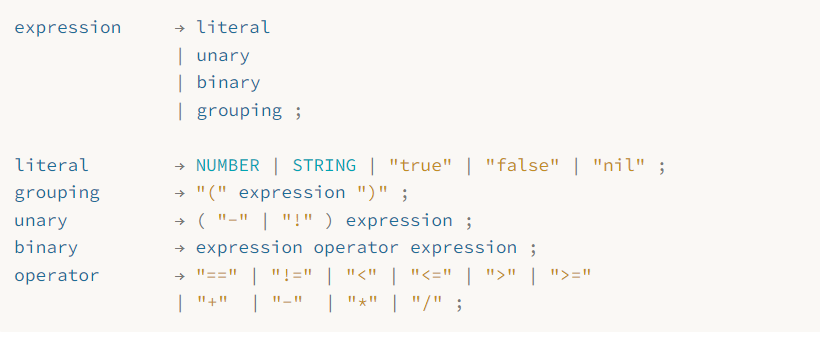
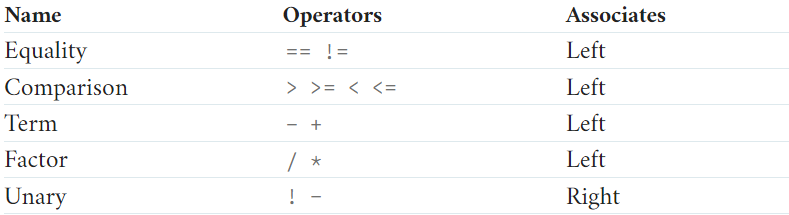
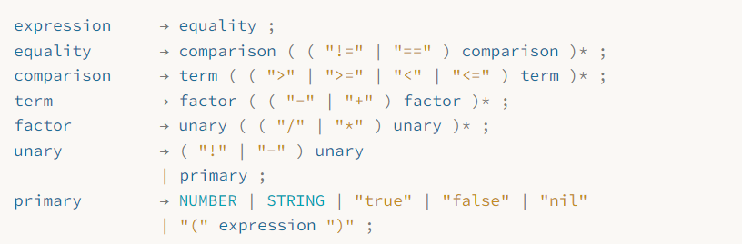

# Lox Interpreters
This is my hands-on implementation of jlox/clox.
You can find the book on [Craft-Interpreters](https://craftinginterpreters.com/contents.html)
The Development process is documented here.

## Jlox
### Stage 0: Lex-Parse-Evaluate
This stage covers:
* Chapter 4: Scanning
* Chapter 5: Representing Code
* Chapter 6: Parsing Expressions
* Chapter 7: Evaluating Expressions


#### Setup
Firstly, we need to have some feedback to see the result of our interpreter.
We can implement a REPL (Read-Eval-Print Loop) to do this.

The first thing we need to do is to implement a `runPrompt` method in `Lox` and call it in `main`.

```java
private static void runPrompt() throws IOException {
    InputStreamReader input = new InputStreamReader(System.in);
    BufferedReader reader = new BufferedReader(input);

    for(;;){
        System.out.print("> ");
        String line = reader.readLine();
        if (line == null) break;
        run(line);
    }
}
```

When we implement a new feature, we can directly test it by running the program.

#### Lexical Analysis
Token
:   a tuple of a type and a value

The first step is to implement a `Scanner` class to tokenize the input.

```java
public class Scanner {
    private final String source;
    private final List<Token> tokens = new ArrayList<>();
}
```

Scanner takes the source code as input and outputs a list of tokens.

To strengthen the readability of the code, we wrap some operaions in a function:

Global Operations:

* `isAtEnd`: check if the current position is at the end of the source code

Character-Wise Operations:
* `advance`: return the character at the current position and move to the next character
* `peek`: get the current character without moving the position
* `peekNext`: get the next character without moving the position
* `match`: check if the next character matches the given character, and move the position if it does
* `isDigit`: check if the given character is a digit
* `isAlpha`: check if the given character is an alpha character
* `isAlphaNumeric`: check if the given character is an alpha or a digit

Token-Wise Operations:
* `string`: get a string token from the current position
* `number`: get a number token from the current position
* `identifier`: get an identifier token from the current position
  * use a `HashMap` to store the keywords

Then you can implement the `scanTokens` method to tokenize the source code.

```java
public List<Token> scanTokens() {
    while (!isAtEnd()) {
        start = current;
        scanToken();
    }
    tokens.add(new Token(TokenType.EOF, "", null, line));
    return tokens;
}
```

In `scanToken`, we use a **switch-case** to handle different token types. Just need to be carefully move the position and add the token to the list.

Also, you can report error while lexing.

#### Parsing
The next step is to implement a `Parser` class to parse the tokens.

Firstly, we need to define the grammar of the language and represent the code using a AST.


```java
public class Expr {
  public abstract <R> R accept(Visitor<R> visitor);
  public static class Binary extends Expr {
    public final Expr left;
    public final Token operator;
    public final Expr right;
    public Binary(Expr left, Token operator, Expr right) {
      this.left = left;
      this.operator = operator;
      this.right = right;
    }
  ...
}
```

We use **Visitor Pattern** to deal with the AST.
Using Visitor Pattern, we could do different things on different nodes in the AST, without messing up the code structure.

Then we can implement the `Parser` class.
We should deal with ambiguity first. Commonly, we determine the follows:

* Precedence
* Associativity: left or right



For precedence, we can say that "**the lower precedence rule can be replaced by the higher one**". So we can construct a grammar like:



A Parser should:

* Given a valid sequence of tokens, produce a corresponding syntax tree.
* Given an _invalid_ sequence of tokens, detect any errors and tell the user about their mistakes.

For the first point, we can use a recursive descent parser to implement the parser. For the second point, we can use error recovery to deal with it.

Token-Wise Helpers:

* `consume`: check if the next token matches the given type, and move the position if it does
* `match`: check if the current token matches any of the given types, and move the position if it does
* `check`: check if the current token matches the given type, but do not move the position
* `peek`: get the current token without moving the position
* `previous`: get the previous token
* `isAtEnd`: check if we have reached the end of the tokens
* `advance`: move the position to the next token

Then translate the **Rules** into **Methods** one by one.
```java
private Expr expression() {
    return equality();
}
private Expr equality() {
    Expr expr = comparison();

    while (match(BANG_EQUAL, EQUAL_EQUAL)) {
        Token operator = previous();
        Expr right = comparison();
        expr = new Expr.Binary(expr, operator, right);
    }

    return expr;
}
```

For syntax errors, we can throw a `ParseError` exception and catch it in its caller. Then do `synchronize` to recover from the error.

```java
private void synchronize() {
    advance();

    while (!isAtEnd()) {
        if (previous().type == SEMICOLON) return;

        switch (peek().type) {
            case CLASS:
            case FUN:
            case VAR:
            case FOR:
            case IF:
            case WHILE:
            case PRINT:
            case RETURN:
                return;
        }

        advance();
    }
}
```

#### Evaluation
The last step is to implement an `Interpreter` class to evaluate the AST.

Now that we have a syntax tree, we can evaluate it. We can use the visitor pattern again to do this, in **post-order**.

For example, for a binary expression, we can evaluate the left and right expressions first, and then apply the operator to the results.

```java
public class Interpreter implements Expr.Visitor<Object>, Stmt.Visitor<Void> {
  @Override
  public Object visitBinaryExpr(Expr.Binary expr) {
    Object left = evaluate(expr.left);
    Object right = evaluate(expr.right);

    switch (expr.operator.type) {
      ...
    }
  }
  ...
}
```

### Stage 1: Statement
This stage covers:
* Chapter 8: Statements and State
* Chapter 9: Control Flow

### Stage 2: Functions
This stage covers:
* Chapter 10: Functions
* Chapter 11: Resolving and Binding

### Stage 3: Classes
This stage covers:
* Chapter 12: Classes
* Chapter 13: Inheritance


## Java Mess
Static Blocks
:   In java, static blocks are used to **initialize the static variables of a class**. They are executed when the class is loaded into memory. Static blocks are **executed only once**, no matter how many objects of the class are created. They are used to initialize the static variables and perform any other static initialization tasks.

```java
class MyClass {
    static int myStaticVar = 0;

    static {
        myStaticVar = 10;
        System.out.println("Static block executed");
    }
}
```

enum
:   An enum is a special "class" that represents **a group of constants** (unchangeable/read-only variables). To define an enum, use the enum keyword (instead of class or interface), and separate the constants with a comma. Enum constants are usually declared as static and final, but this is not required.

```java
public enum TokenType {
    // Single-character tokens.
    LEFT_PAREN, RIGHT_PAREN, LEFT_BRACE, RIGHT_BRACE,
    COMMA, DOT, MINUS, PLUS, SEMICOLON, SLASH, STAR,

    // Keywords.
    AND, CLASS, ELSE, FALSE, FUN, FOR, IF, NIL, OR,
    PRINT, RETURN, SUPER, THIS, TRUE, VAR, WHILE,
    
    EOF
}
```

Extended Switch-Case
: Features:  
  * Multiple Labels
  * No need to `break`
  * Arrow Syntax
  * Expression Support

```java
int day = 3;
String dayType = switch (day) {
    case 1, 7 -> "Weekend";
    case 2, 3, 4, 5, 6 -> "Weekday";
    default -> "Invalid day";
};

System.out.println(dayType); // Output: Weekday
```

varargs
: In Java, varargs (variable-length arguments) is a feature that allows a method to accept a variable number of arguments of the same type. It is declared by using three dots (`...`) after the type of the parameter. The method can then access the varargs parameter as an array.

**The varargs parameter must be the last parameter in the method's parameter list.**

```java
public class VarargsExample {
    public static void printNumbers(int... numbers) {
        for (int number : numbers) {
            System.out.println(number);
        }
    }

    public static void main(String[] args) {
        printNumbers(1, 2, 3, 4, 5);
        }
    }
}
```
